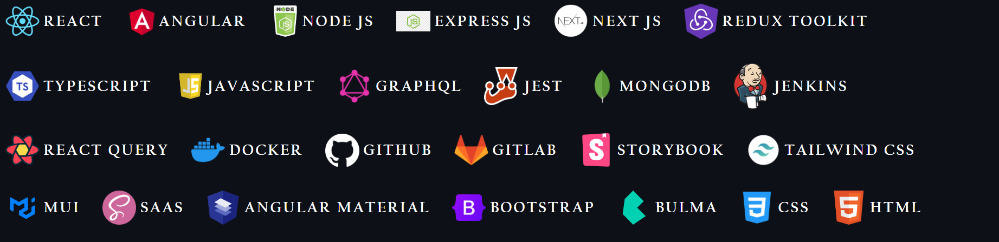

### Hi there 👋

I'm Abhishek Saini, and I'm a Full Stack Web Developer with over 5 years of experience in web development, I am committed to creating high-quality, efficient, and user-friendly web applications. My passion for web development is driven by my desire to make a positive impact on users' lives through intuitive and engaging user interfaces.

My expertise is in modern frontend technologies such as React, Angular, TypeScript, JavaScript, Redux, Apollo, GraphQL, and more, allows me to develop scalable, responsive, and dynamic web applications that can adapt to changing business requirements.

I possess strong collaboration and communication skills, which allow me to work effectively with cross-functional teams, product owners, and team leaders to deliver high-quality results within deadlines. I have experience in code reviewing, architecture, design system, validating merge requests, ensuring code quality and adherence to best practices.

My knowledge of backend technologies such as Node.js, Spring Boot, Express, PostgreSQL and MongoDB allows me to work across the full stack, ensuring seamless integration and communication between the frontend and backend of web applications. I have experience with CI/CD, Docker, Webpack, MVC architecture, RESTful APIs, unit/integration testing.

I am committed to delivering top-notch web applications that are scalable, maintainable, and user-friendly. I am excited about the opportunity to collaborate with a team of passionate professionals and take on new challenges to achieve business goals.

I firmly believe that learning is a lifelong journey, and I am committed to expanding my knowledge and skills by staying up-to-date with the latest frontend technologies and best practices. 

I am deeply passionate about exploring new technologies and pushing my boundaries by building personal projects. These projects not only help me stay current with emerging trends but also allow me to apply my skills and creativity to create innovative solutions.

### Languages and Frameworks:

<!--

-->
